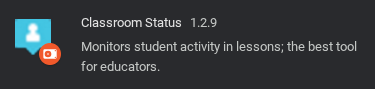

For any educators: **THIS EXTENSION DOES NOT DO ANYTHING**, you may click off now 👋

This is just a fake "**Classroom Status**" Chrome extension, with the icon (transparent bg), but no pop-up (too lazy).

What you might use this for, I have no idea, I just used this to familiarise myself with *manifest.json* files.

Here's how it looks like in chrome://extensions:

Here's how it looks like in extension bar:

Getting a background-less version of the icon was the hardest part of this lmao.
